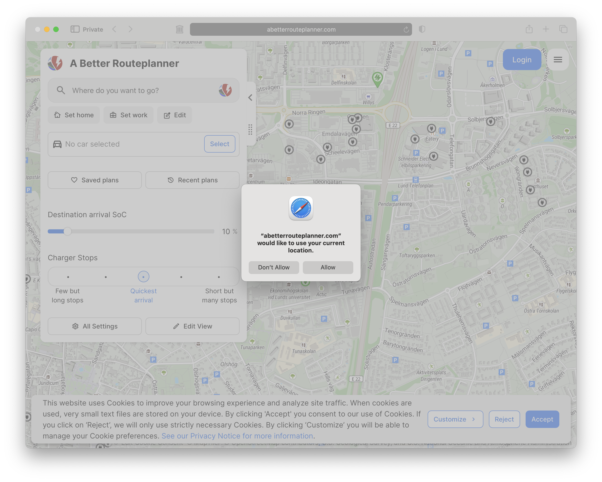

# Getting Started

## The ABRP Website

We'll start on the [ABRP website](https://abrp.com), that will make following along with the tutorial easier and you'll get to see some of the planning features that only show up on a large display. If you haven't already done so, click on the **ABRP website** link.

On you're first visit you'll probably be prompted to allow ABRP to use your location. You don't have to allow this for the tutorial, or to use the website for real planning, but since you'll need to allow location access for navigation there may not be a large privacy downside to allowing the web version to also see your current position. So, **make your choice and lets get started.**

